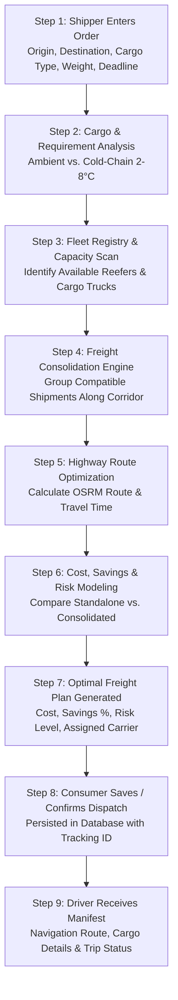

# SMART FREIGHT
### AI-Based Multimodal Freight Consolidation and Cold-Chain Risk Prediction for MSMEs and Agricultural Logistics

---

## 1. Project Overview

**Smart Freight** is an intelligent logistics planning platform designed to solve one of the biggest challenges faced by small and medium enterprises (MSMEs) and agricultural producers in India: **high transportation costs and cargo risks caused by partially filled, uncoordinated freight trips.**

Instead of having multiple small businesses book separate, underutilized trucks, Smart Freight analyzes cargo specifications, routes, deadlines, and temperature requirements to **intelligently consolidate shipments into optimal, shared freight journeys**.

```
TRADITIONAL APPROACH               SMART FREIGHT APPROACH
┌──────────────────┐               ┌─────────────────────────────────┐
│ Shipper A: 1 Ton ├──> Truck 1    │ Shipper A (1 Ton)               │
├──────────────────┤               │ Shipper B (2.5 Tons) ──> 1 Truck│
│ Shipper B: 2.5 T ├──> Truck 2    │ Shipper C (1.5 Tons)            │
├──────────────────┤               └─────────────────────────────────┘
│ Shipper C: 1.5 T ├──> Truck 3      ● 1 Coordinated Trip
└──────────────────┘                 ● Higher Vehicle Utilization
  ● 3 Half-Empty Trucks              ● Reduced Fuel & Highway Costs
  ● 3x Fuel & Toll Costs             ● Lower Carbon Footprint
  ● Higher Spoilage Risk             ● Cold-Chain Monitored
```

---

## 2. The Problem Statement

Small farmers, mandi traders, and MSMEs encounter severe logistics bottlenecks:

1. **Fragmented, Small-Scale Shipments**: Most small businesses do not produce enough volume to fill an entire 10-ton or 16-ton commercial truck on their own.
2. **Wasted Vehicle Capacity (Deadweight)**: Trucks frequently travel 30% to 50% empty, driving up the per-kilogram freight cost for each individual shipper.
3. **High Operational Expenses**: Paying for separate dedicated vehicles multiplies diesel consumption, highway tolls, and driver fees.
4. **Vulnerability of Perishable Produce**: Agricultural goods (tomatoes, fruits, dairy, fish) easily spoil without active temperature monitoring, proper handling, and time-sensitive route planning.
5. **Route Hazards & Unpredicted Delays**: Congestion, highway bottlenecks, and unpredictable transit conditions increase delivery delays and spoilage risk.
6. **Lack of Accessible Technology**: Small businesses lack enterprise logistics software and cannot easily match with nearby shippers heading in the same direction.
7. **No Unified Decision Engine**: Existing solutions treat cost, capacity, routing, and cargo safety as separate problems rather than evaluating them together.

---

## 3. The Smart Freight Solution

Smart Freight acts as an **intelligent freight dispatch and consolidation engine**. It connects cargo demands with optimal vehicle capacity and safe highway corridors.

The platform continuously evaluates:
* **Cargo Payload & Volume** (Weight, bulk, compatibility)
* **Vehicle Fleet Specifications** (Capacity, refrigerated vs. ambient)
* **Highway Corridor Geometry** (OSRM street-level distances and transit times)
* **Delivery Deadlines & Priority** (Standard, Express, Urgent)
* **Temperature Sensitivity** (Cold-chain reefer compliance for perishables)
* **Corridor Risk Factors** (Delay risk, route hazards, road conditions)

### Core Value Proposition:
* **Reduces Shipping Costs**: Shippers share freight capacity and pay only for their portion.
* **Maximizes Fleet Efficiency**: Vehicle utilization increases from under 50% to over 85%.
* **Protects Perishable Goods**: Cold-chain compliance and route risk analysis safeguard perishable cargo.
* **Streamlines Operations**: Provides connected, real-time dashboards for both cargo owners (Consumers) and transport drivers.

---

## 4. What Smart Freight Actually Does

| Capability | What It Does | Benefit to Shippers & Operators |
| :--- | :--- | :--- |
| **Cargo Ingestion** | Takes shipment requirements (cargo type, weight, origin, destination, deadline). | Instant digital booking without manual broker negotiations. |
| **Fleet Compatibility Matching** | Identifies eligible vehicles in the registry based on weight capacity and cooling needs. | Eliminates mismatching (e.g., placing perishables in non-insulated trucks). |
| **Freight Consolidation** | Combines compatible cargo heading along the same corridor into a single journey. | Cuts individual transport bills by up to 33%. |
| **Corridor Route Optimization** | Calculates actual road distances and highway transit times using OSRM mapping. | Identifies faster, reliable highway routes (e.g., NH-16 arterial). |
| **Cost & Savings Calculation** | Compares standalone direct trips vs. consolidated multi-shipper plans. | Transparent financial breakdown showing exact rupee savings. |
| **Comprehensive Risk Prediction**| Assesses congestion, transit duration, and cargo vulnerability. | Shippers receive a risk-rated plan (Low / Medium / High tier). |
| **Cold-Chain Supervision** | Enforces 2°C – 8°C chilled reefer requirements for dairy, produce, and pharma. | Minimizes agricultural spoilage and food waste. |
| **Dual User Experience** | Dedicated portals for Shippers (Consumers) and Fleet Operators (Drivers). | Unified, end-to-end visibility from dispatch order to final delivery. |

---

## 5. End-to-End Workflow



### Step-by-Step Breakdown:
1. **Step 1 — Input Cargo**: User enters cargo name, payload weight (kg), pickup city, destination city, schedule dates, and SLA priority.
2. **Step 2 — Requirement Validation**: System classifies the shipment (e.g., Fresh Tomatoes = Cold-Chain Reefer required).
3. **Step 3 — Vehicle Capacity Scan**: Available fleet assets are evaluated against payload and cooling constraints.
4. **Step 4 — Consolidation Pairing**: Compatible loads along the same corridor (e.g., Bhubaneswar $\rightarrow$ Kolkata via NH-16) are grouped.
5. **Step 5 — Highway Route Geometry**: Street routing engine computes real driving coordinates, distances, and duration.
6. **Step 6 — Risk & Cost Modeling**: System models standalone costs versus shared carrier costs and evaluates corridor hazards.
7. **Step 7 — Plan Presentation**: The shipper receives a clear recommendation showing vehicle type, transit time, cost, net savings, and risk grade.
8. **Step 8 — Dispatch Confirmation**: The shipper saves the plan, generating a registered shipment record in the system.
9. **Step 9 — Driver Execution**: The trip manifest appears on the Driver Portal with turn-by-turn routing and delivery checkpoints.

---

## 6. Main Platform Features

### A. Dispatch Control Tower & Dashboard
* Real-time operational overview showing active corridors, ready carrier assets, aggregate consolidation yields, and cold-chain status.
* Interactive 4-card metric strip highlighting corridor health, fleet readiness, and average savings.

### B. Shipment Dispatch Protocol
* Structured booking interface for entering cargo specifications, payload weight, pickup schedule, and delivery deadlines.
* Built-in input validation preventing overloaded vehicles or mismatched delivery windows.

### C. Fleet Vehicle Comparison Matrix
* Live registry comparing available transport options (Mini Electric Vans, Medium Refrigerated Reefers, Heavy Multimodal Trucks).
* Clear status badges indicating capacity fit percentage, refrigeration capability, and availability.

### D. Highway Navigation & Street Map
* Integrated vector map displaying the active road corridor, vehicle transit animation, distance indicators, and estimated travel duration.
* Replay feature allowing users to visually inspect highway milestones and corridor geometry.

### E. Economic Savings & Cost Breakdown
* Transparent financial comparison highlighting standalone market rates against the optimized Smart Freight consolidated rate.
* Instant visual indicator of net rupee savings and percentage discount.

### F. Multi-Factor Risk Assessment
* Evaluates highway congestion, weather risk, road quality, and cargo vulnerability.
* Displays color-coded risk indicators (Olive Green for Nominal / Amber for Caution / Terracotta for Elevated Risk).

### G. Cold-Chain & Perishable Cargo Safeguard
* Dedicated handling rules for temperature-sensitive cargo (2°C – 8°C chilled compartment).
* Guarantees that perishable foods (dairy, produce, seafood) are assigned strictly to certified reefer units.

### H. Driver Portal & Trip Manifest
* Tailored interface for commercial drivers displaying assigned vehicle IDs, pickup/drop coordinates, live telemetry status, and cargo manifests.

---

## 7. Cost & Savings Demonstration Model

> [!NOTE]
> *The following figures represent project demonstration benchmark data used to illustrate the platform's economic consolidation mechanics.*

```
┌─────────────────────────────────────────────────────────────────────────┐
│                     ECONOMIC CONSOLIDATION COMPARISON                   │
├───────────────────────────────────────────────────┬─────────────────────┤
│ Scenario                                          │ Total Freight Cost  │
├───────────────────────────────────────────────────┼─────────────────────┤
│ 3 Separate Standalone Trips (Traditional Market)   │ ₹54,000             │
│ 1 Smart Freight Consolidated Journey (Shared)     │ ₹36,000             │
├───────────────────────────────────────────────────┼─────────────────────┤
│ ESTIMATED FINANCIAL SAVINGS                       │ ₹18,000 (+33.3%)    │
│ AVERAGE FLEET CAPACITY UTILIZATION                │ 87.4%               │
└───────────────────────────────────────────────────┴─────────────────────┘
```

### Why Costs Drop:
1. **Shared Fuel & Toll Expenses**: Fixed highway costs are divided proportionally among consolidated payloads.
2. **Elimination of "Deadhead" Space**: Trucks travel with 85%+ filled cargo beds rather than returning or traveling half-empty.
3. **Optimized Vehicle Sizing**: Cargo is matched to the exact vehicle capacity needed, avoiding oversized trucks for light payloads.

---

## 8. Multi-Factor Risk Prediction

Smart Freight does not only seek the cheapest route—it actively balances **Cost, Speed, Delivery Reliability, and Cargo Safety**.

```
                           ┌───────────────────────────┐
                           │   SMART FREIGHT ENGINE    │
                           └─────────────┬─────────────┘
                                         │
            ┌───────────────────┬────────┴──────────┬───────────────────┐
            ▼                   ▼                   ▼                   ▼
    ┌───────────────┐   ┌───────────────┐   ┌───────────────┐   ┌───────────────┐
    │  Corridor     │   │  Perishable   │   │  Highway      │   │  Delivery     │
    │  Congestion   │   │  Spoilage     │   │  Road Quality │   │  SLA Deadline │
    │  Analysis     │   │  Risk         │   │  & Weather    │   │  Compliance   │
    └───────────────┘   └───────────────┘   └───────────────┘   └───────────────┘
```

* **Delay Risk**: Evaluates peak corridor traffic and bottlenecks along major national highways (e.g., NH-16).
* **Spoilage Risk**: Flags trips where transit duration might exceed the safe holding window for refrigerated or perishable goods.
* **Corridor Integrity**: Considers known highway maintenance zones and detour risks.

---

## 9. Connected Dual Experience: Consumer & Driver

```
┌──────────────────────────────────────┐       ┌──────────────────────────────────────┐
│          CONSUMER DASHBOARD          │       │           DRIVER DASHBOARD           │
├──────────────────────────────────────┤       ├──────────────────────────────────────┤
│ ● Plan & customize shipment orders   │       │ ● View assigned trip & route path    │
│ ● Compare vehicle options & rates    │       │ ● Inspect cargo type & payload (kg)  │
│ ● View real-time savings & risk %    │  ───> │ ● Monitor cold-chain reefer target   │
│ ● Save and register dispatch plans   │       │ ● Checkpoint delivery confirmation   │
│ ● Track overall shipment ledger      │       │ ● Clear, distraction-free interface  │
└──────────────────────────────────────┘       └──────────────────────────────────────┘
                                  ▲                 ▲
                                  │                 │
                                  └────────┬────────┘
                                           │
                             CENTRAL DISPATCH DATABASE
```

* **For Shippers (MSMEs/Farmers)**: Focuses on economics, delivery timeframes, risk rating, and vehicle suitability.
* **For Drivers**: Focuses on operational clarity, cargo safety rules, route navigation, and destination milestones.

---

## 10. Technology Stack Summary

| Layer | Technologies Used | Purpose |
| :--- | :--- | :--- |
| **Frontend Framework** | Next.js 16 + React 19 | High-performance, reactive web interface and fast client-side navigation. |
| **Styling & Design System** | Tailwind CSS + Custom Design System | Warm, tactile Indian logistics design system inspired by parchment, earth, and terracotta. |
| **Data Visualization** | Recharts + Vector Canvas | Clear, presentation-grade charts for cost waterfall, risk radar, and savings analytics. |
| **Interactive Maps** | Leaflet + OpenStreetMap | Smooth, animated street-level route navigation along real Indian highway corridors. |
| **Backend & APIs** | Python + FastAPI | High-speed REST API managing routing logic, optimization algorithms, and calculations. |
| **Routing Engine** | OSRM (Open Source Routing Machine) | Real-world road network geometry, driving distances, and duration calculations. |
| **Data Persistence** | SQLite Database | Stores vehicle fleets, registered shipments, user accounts, and trip manifests. |

---

## 11. What Makes Smart Freight Different?

1. **Tailored for MSMEs & Agriculture**: Built specifically for smaller producers who cannot afford dedicated enterprise logistics fleets.
2. **Consolidation First**: Groups fragmented shipments together instead of treating each order as an isolated, costly trip.
3. **Cost + Risk Combined**: Simultaneously evaluates monetary savings and cargo delivery safety.
4. **Built-in Cold-Chain Guard**: Protects perishable fruits, vegetables, and dairy with automated reefer assignment.
5. **Integrated Highway Mapping**: Uses real Indian road network coordinates (e.g., NH-16 Eastern Corridor) rather than straight-line approximations.
6. **Two-Sided Operational Portal**: Keeps both cargo owners and transport drivers perfectly aligned on the same trip data.
7. **Culturally Grounded Design**: Features a warm, intuitive interface designed around Indian logistics realities (Mandis, arterial highways, regional nodes).

---

## 12. Target Beneficiaries & Users

```
  🌾 FARMERS & GROWERS           🏭 MSMEs & SMALL PRODUCERS        🚛 TRANSPORT OPERATORS
  Transports perishable crops    Consolidates small shipments      Maximizes truck bed fill-rate
  to urban wholesale mandis      without paying for full trucks    and increases revenue per km
```

* **Small Farmers & Agricultural Cooperatives**: Ship fresh fruits, vegetables, and flowers to distant wholesale markets without incurring heavy spoilage losses.
* **MSMEs & Cottage Manufacturers**: Move manufactured goods, textiles, and spare parts at shared, consolidated freight rates.
* **Dairy & Cold-Chain Shippers**: Gain reliable, temperature-monitored refrigerated transport for milk, dairy products, and pharmaceuticals.
* **Fleet Owners & Commercial Drivers**: Reduce empty return trips and increase revenue per kilometer by filling unused truck bed space.
* **Mandi & Supply Chain Aggregators**: Coordinate daily dispatches across regional trade nodes with digital transparency.

---

## 13. Potential Real-World Impact

* **Economic Benefits**:
  * Can reduce transportation bills for small businesses by up to 30%–35%.
  * Increases vehicle asset utilization from ~50% to over 85%.
* **Operational Efficiency**:
  * Replaces fragmented phone calls and middleman brokers with automated corridor matching.
  * Reduces vehicle downtime and unnecessary empty return trips.
* **Agricultural Protection**:
  * Helps prevent post-harvest spoilage of perishable produce through cold-chain matching and time-sensitive route planning.
* **Environmental Sustainability**:
  * Fewer partially loaded vehicles on national highways can potentially lead to lower aggregate diesel consumption and reduced transport emissions.

---

## 14. Illustrative Example Case

### Scenario: The Odisha to West Bengal Highway Corridor
Three independent businesses in Odisha need to send goods to Kolkata on Tuesday:
* **Shipper 1 (Cuttack Mandi)**: 1,200 kg of fresh tomatoes (Requires Chilled Transport).
* **Shipper 2 (Bhubaneswar Co-op)**: 800 kg of packaged dairy products (Requires Chilled Transport).
* **Shipper 3 (Balasore Trader)**: 1,500 kg of processed food goods (Requires Chilled Transport).

### The Traditional Approach:
* Each business books a separate pickup or light truck.
* **Total Vehicles on Road**: 3 trucks (each less than 40% full).
* **Combined Cost**: ~₹54,000.
* **Outcome**: High expense, 3x fuel burned, severe underutilization.

### The Smart Freight Approach:
1. Smart Freight ingests all three requests heading along the **NH-16 Corridor**.
2. Identifies that all three require **Active Cold-Chain (2°C – 8°C)**.
3. Consolidates the combined payload (**3,500 kg**) into **one 5,000 kg Refrigerated Truck**.
4. Computes the optimal pickup sequence (Bhubaneswar $\rightarrow$ Cuttack $\rightarrow$ Balasore $\rightarrow$ Kolkata).
5. **Combined Consolidated Cost**: ~₹36,000.
6. **Total Savings**: **₹18,000 (33.3% savings)** shared across all three shippers.
7. **Outcome**: 1 single truck, 87.5% capacity utilization, fresh deliverable goods, significantly lower carbon footprint.

---

## 15. Future Scope & Roadmap

> [!IMPORTANT]
> *The following capabilities represent planned future enhancements and research extensions beyond the current core application:*

* **IoT Sensor Telemetry Integration**: Live temperature and humidity streaming directly from cargo container sensors into the dashboard.
* **Real-Time GPS Fleet Tracking**: Live satellite positioning and geo-fencing alerts for active vehicles in transit.
* **Dynamic Traffic & Weather Feeds**: Live highway API integration for automatic on-the-fly detour recommendations.
* **Machine Learning Demand Forecasting**: Predictive seasonal demand estimation for regional agricultural harvest cycles.
* **Multimodal Rail-Road Integration**: Expanding consolidation algorithms to include dedicated freight rail corridors (DFCs).
* **Automated Smart Contracts & Escrow**: Instant payment settlement upon digital proof of delivery (e-POD).

---

## 16. Final Project Vision

> **"SMART FREIGHT aims to democratize Indian logistics by making freight transportation smarter, more affordable, safer, and highly coordinated for the farmers, MSMEs, and transport operators who power the nation's economy."**

---

### Key Presentation Takeaways for Slide Decks:
* **The Problem**: Small shipments = Empty truck space + High costs + Spoilage risks.
* **The Solution**: Multimodal consolidation + Cold-chain compliance + Route risk analysis.
* **The Result**: ~33% cost savings, 85%+ vehicle fill rate, lower spoilage, and unified digital control.
