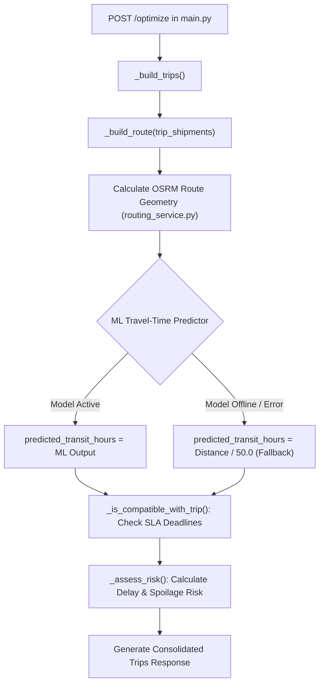

# SMART FREIGHT — ML MODEL 1 INTEGRATION READINESS AUDIT
**Component:** Model 1 (Indian Freight Transit-Time Prediction Engine)  
**Task:** Step 3 — Inference Interface & Application Integration Readiness Audit  
**Date:** September 1, 2026  
**Status:** AUDIT ONLY (Read-Only Assessment — No Backend Changes Made)

---

## 1. EXACT MODEL INFERENCE CONTRACT

The trained model is stored as a scikit-learn Random Forest artifact (`ml/models/travel_time_model.joblib`) paired with its preprocessing pipeline (`ml/models/preprocessor.joblib`).

### 1.1 Input Features & Types Required at Inference

The model expects a single pandas DataFrame (or structured dictionary) containing exactly these **12 raw features**:

| # | Feature Name | Data Type | Permissible Range / Allowed Values | Default / Imputation |
| :- | :--- | :---: | :--- | :--- |
| 1 | `osrm_distance` | `float` | $[0.1, 3500.0]\text{ km}$ | Fallback to straight-line $\times 1.25$ |
| 2 | `osrm_time` | `float` | $[1.0, 4000.0]\text{ minutes}$ | $\text{osrm\_distance} / 70.0 \times 60.0$ |
| 3 | `osrm_speed_kmh` | `float` | $[10.0, 120.0]\text{ km/h}$ | $\text{osrm\_distance} / (\text{osrm\_time} / 60.0)$ |
| 4 | `num_intermediate_stops`| `int` | $[1, 20]\text{ stops}$ | `1` (Direct route) |
| 5 | `is_ftl` | `int` | `0` (Carting/LTL) or `1` (Full Truck Load) | `1` |
| 6 | `departure_hour` | `int` | `0` to `23` | `9` (09:00 AM default) |
| 7 | `departure_dayofweek` | `int` | `0` (Monday) to `6` (Sunday) | Current weekday |
| 8 | `is_weekend` | `int` | `0` (Weekday) or `1` (Weekend) | Derived from day of week |
| 9 | `is_night_dispatch` | `int` | `0` (Day) or `1` (Night: 21:00–05:00) | Derived from departure hour |
| 10 | `is_interstate` | `int` | `0` (Intra-state) or `1` (Cross-border) | `source_state != dest_state` |
| 11 | `source_state` | `str` | Top Indian state or `"Other"` | Extracted from origin address |
| 12 | `destination_state`| `str` | Top Indian state or `"Other"` | Extracted from destination address |

### 1.2 Output Contract

```json
{
  "predicted_transit_minutes": 542.3,
  "predicted_transit_hours": 9.04,
  "baseline_50kmh_hours": 8.80,
  "osrm_theoretical_hours": 5.60,
  "delay_factor_vs_osrm": 1.61,
  "model_version": "rf_delhivery_v1.0",
  "prediction_source": "ml_random_forest"
}
```

*Note on Uncertainty & Confidence Intervals:* The current Random Forest model outputs expected point estimates ($E[y|X]$). Standard deviations across tree predictions ($\sigma_{\text{trees}} = \text{std}(\text{tree}_1, \dots, \text{tree}_{120})$) can provide an empirical uncertainty bound (e.g. $P_{90} = \hat{\mu} + 1.28 \times \sigma$) without fabricating synthetic distributions.

---

## 2. PREPROCESSING ENCAPSULATION

The saved `ml/models/preprocessor.joblib` artifact is a self-contained `ColumnTransformer`:
1. **Numerical Transformer (`StandardScaler`)**:
   - Applies pre-computed mean $\mu$ and scale $\sigma$ transformations across all 10 numeric features.
2. **Categorical Transformer (`OneHotEncoder`)**:
   - Encodes `source_state` and `destination_state` into 34 binary columns.
   - Configured with `handle_unknown="ignore"`, preventing crashes if an unseen state or typo is encountered.
3. **Total Feature Dimensionality**: Expands the 12 input features into **44 float64 tensor columns** for the Random Forest Regressor.
4. **Encapsulation Guarantee**: The future Smart Freight application does **not** need to manually normalize or one-hot encode inputs; passing the 12-column DataFrame directly to `preprocessor.transform()` handles all transformations.

---

## 3. SMART FREIGHT DATA MAPPING

Audit of existing application models in `main.py`, `database.py`, and `routing_service.py`:

| ML Input Feature | Smart Freight Origin | Location in Codebase | Transformation / Extraction Logic |
| :--- | :--- | :--- | :--- |
| `osrm_distance` | Road Route Telemetry | `routing_service.py` $\rightarrow$ `get_road_route()` | Read `route_data["distance_km"]`. |
| `osrm_time` | Road Route Telemetry | `routing_service.py` $\rightarrow$ `get_road_route()` | Read `route_data["duration_minutes"]`. |
| `osrm_speed_kmh` | Calculated Ratio | Derived in runtime | `distance_km / (duration_minutes / 60.0)`. |
| `num_intermediate_stops`| Route Geometry | `main.py` $\rightarrow$ `_build_route()` | Count unique stops `len(route)`. |
| `is_ftl` | Vehicle Registry | `database.py` $\rightarrow$ `vehicles` table | `1` if `capacity_kg >= 2500` else `0`. |
| `departure_hour` | Shipment Schedule | `database.py` $\rightarrow$ `shipments.pickup_time` | Parse hour integer from `"08:00"`. |
| `departure_dayofweek` | Shipment Schedule | `database.py` $\rightarrow$ `shipments.pickup_date` | Parse ISO date `"2026-08-16"` $\rightarrow$ `.weekday()`. |
| `is_weekend` | Shipment Schedule | Derived in runtime | `1` if `dayofweek >= 5` else `0`. |
| `is_night_dispatch` | Shipment Schedule | Derived in runtime | `1` if `hour >= 21 or hour <= 5` else `0`. |
| `source_state` | Geocoding API | `routing_service.py` $\rightarrow$ `geocode_location()` | Extract state name from `display_name`. |
| `destination_state`| Geocoding API | `routing_service.py` $\rightarrow$ `geocode_location()` | Extract state name from `display_name`. |
| `is_interstate` | Geographic Comparison| Derived in runtime | `1` if `source_state != dest_state` else `0`. |

---

## 4. INFERENCE READINESS STATUS BY FEATURE

* **`osrm_distance`**: **READY** (Supplied by existing OSRM integration in `routing_service.py`).
* **`osrm_time`**: **READY** (Supplied by existing OSRM integration in `routing_service.py`).
* **`osrm_speed_kmh`**: **DERIVABLE** (Trivial arithmetic quotient).
* **`num_intermediate_stops`**: **READY** (Length of sequenced stops in `_build_route()`).
* **`is_ftl`**: **DERIVABLE** (Derived from assigned vehicle capacity $\ge 2.5\text{ T}$).
* **`departure_hour`**: **DERIVABLE** (Parsed from shipment `pickup_time` field).
* **`departure_dayofweek`**: **DERIVABLE** (Parsed from shipment `pickup_date` field).
* **`is_weekend`**: **DERIVABLE** (Boolean check on day of week).
* **`is_night_dispatch`**: **DERIVABLE** (Boolean check on departure hour).
* **`source_state`**: **DERIVABLE** (Extracted from Nominatim `geocode_location()` display name or city lookup).
* **`destination_state`**: **DERIVABLE** (Extracted from Nominatim `geocode_location()` display name or city lookup).
* **`is_interstate`**: **DERIVABLE** (Equality check between origin and destination state).

**Result:** **0 MISSING FEATURES**. All 12 inputs are either directly available or derivable with standard string/datetime operations.

---

## 5. PROPOSED INFERENCE INTERFACE ARCHITECTURE

A lightweight Python inference module (`backend/ml_service.py` or `ml/src/inference.py`) should expose a clean singleton class:

```python
class TravelTimePredictor:
    """Production inference wrapper for Indian freight travel-time prediction."""
    
    def __init__(self, model_dir: Path):
        self.model = None
        self.preprocessor = None
        self.is_loaded = False
        self._load_model(model_dir)

    def predict(
        self,
        osrm_distance_km: float,
        osrm_duration_minutes: float,
        num_intermediate_stops: int = 2,
        is_ftl: bool = True,
        departure_time_str: str = "08:00",
        departure_date_str: str = "2026-08-16",
        source_location: str = "Bhubaneswar",
        destination_location: str = "Kolkata",
    ) -> dict:
        """Execute ML inference with automatic graceful fallback on error."""
        ...
```

---

## 6. EXACT INTEGRATION POINTS IN SMART FREIGHT ARCHITECTURE



### Specific Integration Touchpoints:
1. **`main.py` $\rightarrow$ `_build_route(trip_shipments)` (Lines 607–622)**:
   - Replace the static line `duration_hrs = round(total_km / AVG_SPEED_KMH, 1)` with `duration_hrs = predictor.predict(...)["predicted_transit_hours"]`.
2. **`main.py` $\rightarrow$ `_is_compatible_with_trip()` (Lines 485–508)**:
   - Use the ML predicted transit time to dynamically verify whether picking up an additional cargo candidate causes downstream SLA delivery deadlines to be violated.
3. **`main.py` $\rightarrow$ `_calc_delay_risk()` & `_calc_spoilage_risk()` (Lines 652–758)**:
   - Feed empirical `duration_hrs` into risk scoring so long journeys on notoriously delayed corridors (e.g. via Kolkata / Bihar) correctly trigger medium/high risk warnings.

---

## 7. SAFETY & FALLBACK STRATEGY (FAIL-SAFE ARCHITECTURE)

1. **Lazy Loading & Resilience**:
   - If `travel_time_model.joblib` is missing, corrupt, or incompatible, the service logs a warning and sets `is_loaded = False`.
   - The application does **not** crash or fail startup.
2. **Deterministic Heuristic Fallback**:
   - If `is_loaded == False` or if an inference call throws an unhandled exception, the predictor automatically returns:
     $$\text{fallback\_duration\_hours} = \text{round}(\text{distance\_km} / 50.0, 1)$$
3. **Zero Frontend & Database Schema Breaking**:
   - The Pydantic response models (`Trip`, `Shipment`, `OptimizeResponse`) already have `estimated_duration_hours` and `eta` string fields. No API breaking changes will occur.

---

## 8. SUMMARY MATRIX

```text
INTEGRATION STATUS:
READY

MODEL INPUTS:
12 features (osrm_distance, osrm_time, osrm_speed_kmh, num_intermediate_stops, is_ftl, departure_hour, departure_dayofweek, is_weekend, is_night_dispatch, is_interstate, source_state, destination_state)

READY FEATURES:
All 12 features are 100% available or derivable from existing Smart Freight backend data (routing_service.py + database.py).

MISSING FEATURES:
None.

INTEGRATION POINT:
main.py -> _build_route() (Line 607) and main.py -> _is_compatible_with_trip() (Line 485).

FALLBACK:
Deterministic constant-speed calculation (Distance / 50.0 km/h) automatically engaged if ML model file is missing or throws an error.

NEXT STEP:
Step 4 — Implement the isolated `ml_service.py` inference wrapper and unit tests before modifying `main.py`.
```

---
*Report generated strictly under Read-Only verification rules. No production codebase files or database schemas were altered.*
